# TUGAS 4 Experiment Chapter 3

Nama : Yulia Eka Ardhani

Kelas : TI 3C / 21

NIM : 2041720064

## Langkah-langkah praktikum

### Uji Coba PySpark
Menjalankan service dari pyspark terlebih dahulu dengan perintah 

<code>cd spark-2.0.0-bin-hadoop2.7</code>

<code>bin/pyspark</code>

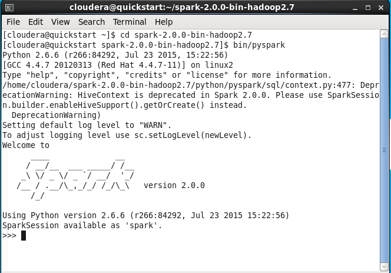

1. Uji coba  <code> Accumulator.py </code>
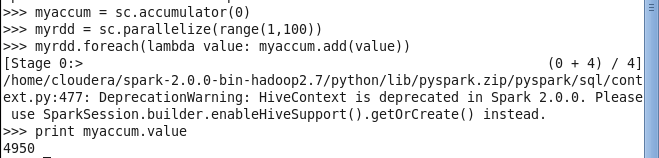

2. Uji coba <code> BroadCast.py </code>
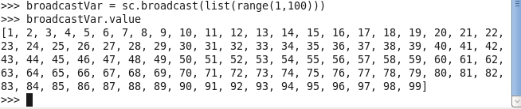

3. Uji coba <code> LogAnalytics.py </code>
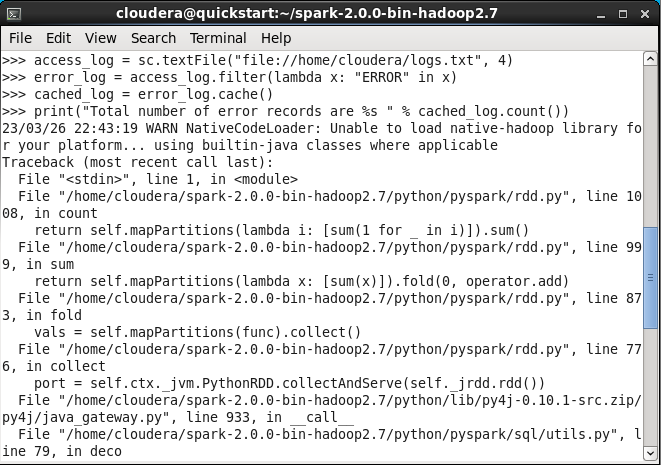
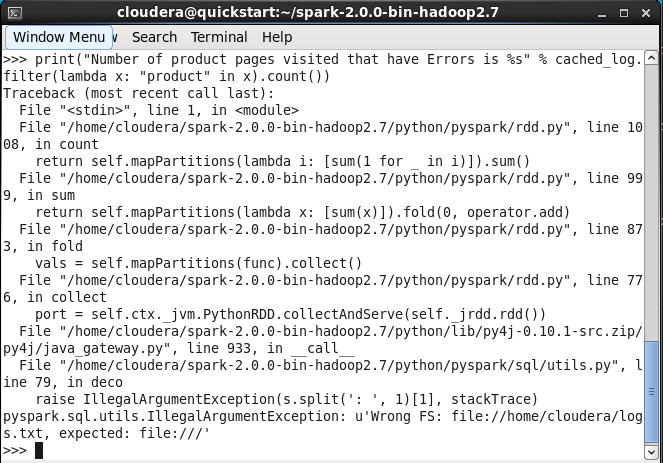

4. Uji coba <code> PairRDD.py </code>
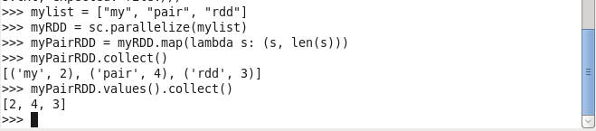

5. Uji coba <code> UnderstandingRDD.py </code>
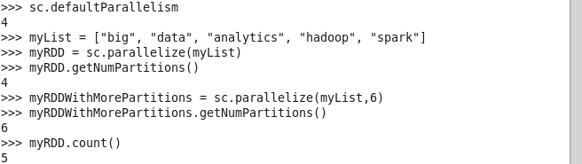
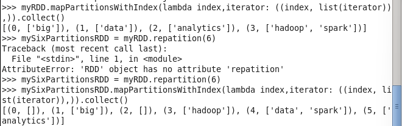
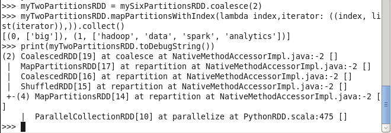

6. Uji coba <code> WordCount.py </code>
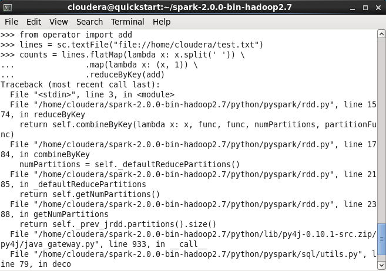
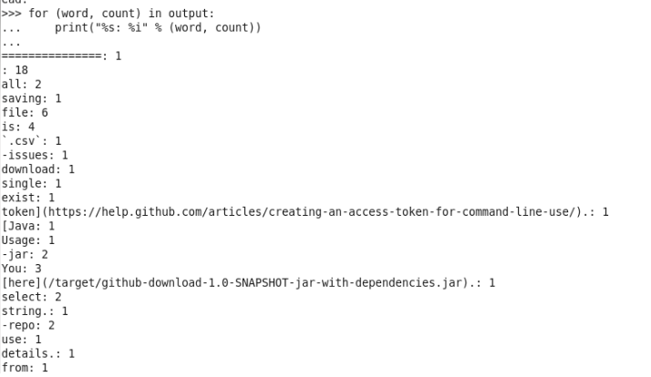

### Uji Coba Scala
Menjalankan service dari sparkshell terlebih dahulu dengan perintah
<code>cd spark-2.0.0-bin-hadoop2.7</code>

<code>bin/spark-shell</code>

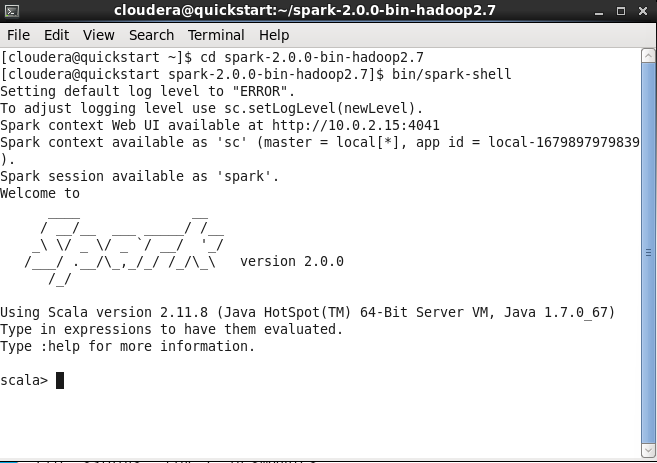

Jalankan juga service cloudera manager dengan perintah:

<code> sudo /home/cloudera/cloudera-manager --express --force </code>
kemudian login pada browser. Setelah itu, jalankan service HDFS

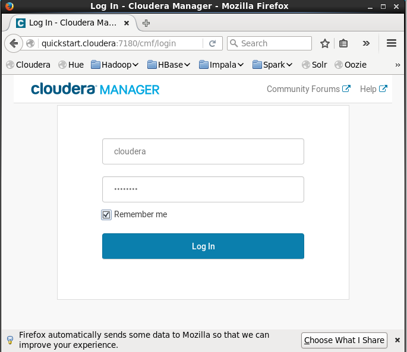
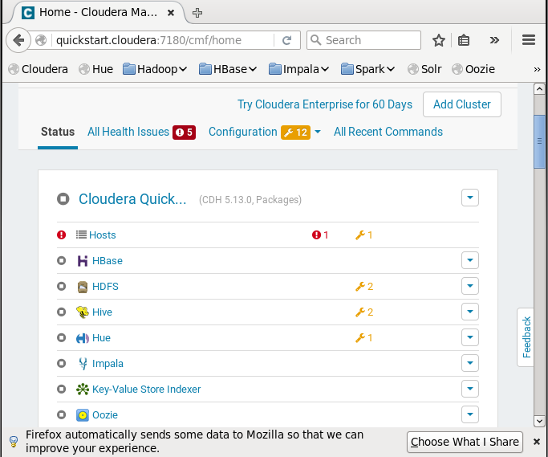

1. Uji coba <code> SystemCommandsOutput.scala </code>
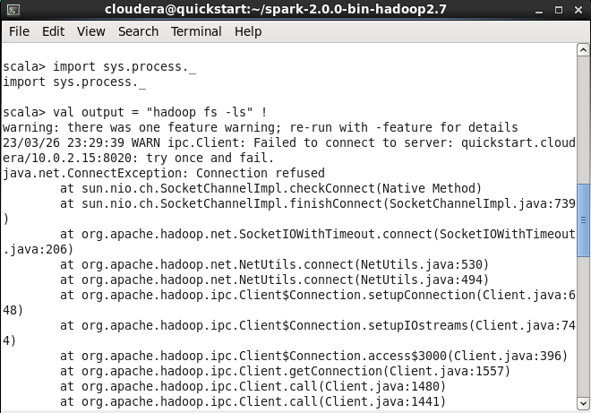
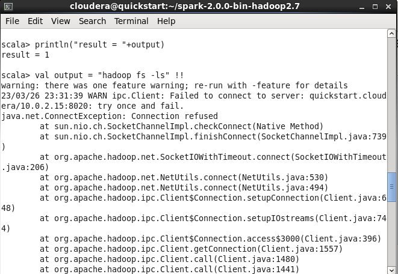
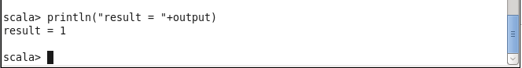

2. Uji coba <code> SystemCommandsReturnCode.scala </code>
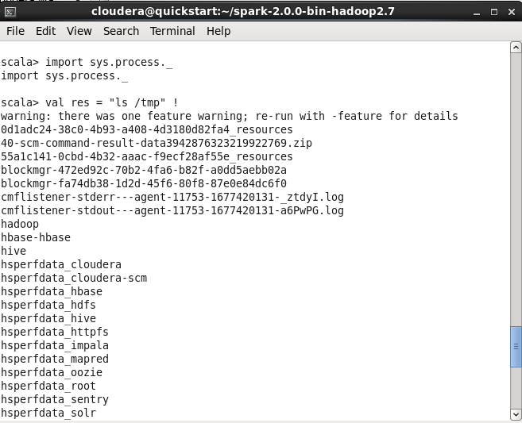
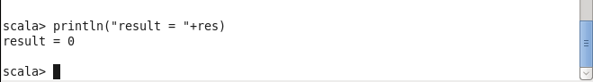
Sukses menampilkan list file pada folder /tmp (temporary file)